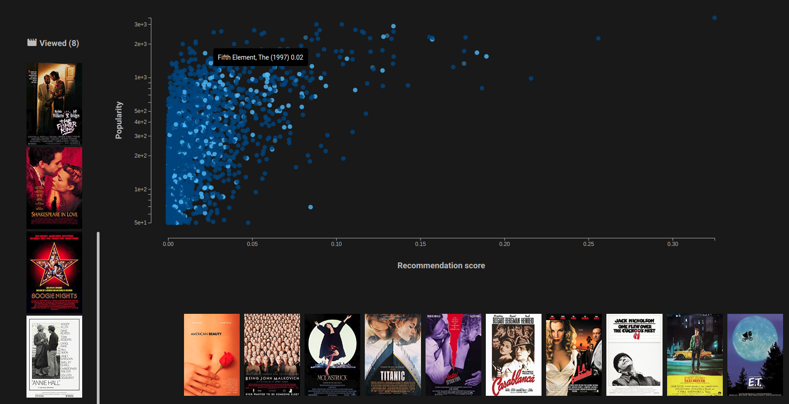

# Ejemplo de sistema de recomendación utilizando autoencoders

El modelo está desarrollado en `pytorch` y su implementación se puede encontrar
en [el módulo model](model).

* [Explicación de autoencoders](Autoencoders.ipynb).
* [Entrenamiento para el sistema de recomendación](Entrenamiento.ipynb).

Se puede correr una aplicación de ejemplo mediante un contenedor docker con
los siguientes comandos.

```
    docker build . --tag recsys_example
    docker run -i -p 8899:8899 recsys_example
```

Se abrirá una aplicación en el puerto 8899 con la siguiente pinta.



En el gráfico se puede observar en abscisas la puntación que el sistema asigna
para cada película y en ordenadas la popularidad de cada película.

Si se van añadiendo películas (pinchando en el gráfico o a través de el selector)
que el usuario a visto, las puntuaciones se van modificando y las películas
recomendadas cambias.

Hay que tener en cuenta que para que de unas recomendaciones suficientemente
robustas es necesario añadir en torno a 20 películas, ya que es el número mínimo
de películas que un usuario había visto en el dataset de entrenamiento.